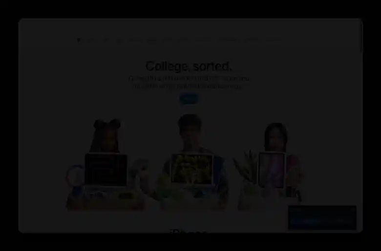

# Visual Feedback for Claude Code

<p align="center"></p>

A Chrome/Edge (MV3) extension that lets you mark elements on any live page and send
structured feedback to your local coding agent. Click an element, type what should change,
and the extension captures the CSS selector, the computed styles, and a cropped screenshot
(the latter two toggleable), then writes a structured JSON batch to a local inbox folder your
agent reads.

The screenshot part is simple: on each click the extension grabs the visible tab once, crops
the image down to just the element you clicked, and embeds that small WebP inside the JSON
batch. It never records the screen and never uploads anything.

No account, no server, nothing leaves your machine. It loads unpacked, so there is no build
step, no native binary, and no install script.

## Why

Describing a front-end change in words is lossy. "The button on the pricing card, third one,
a bit more padding and the wrong blue" becomes a hunt for the right element and the right rule.
This tool turns a click into an exact anchor (unique selector, DOM path, instance index, visible
text, stable vs hashed classes) plus the element's current computed CSS and a screenshot, so the
agent edits the right thing on the first pass.

## Install (once)

1. Open `chrome://extensions` (or `edge://extensions`) and turn on **Developer mode**.
2. Click **Load unpacked** and select the `extension/` folder.
3. Pin it to the toolbar.

## Use

1. Click the toolbar icon and press **Start annotating** (or bind a shortcut at
   `chrome://extensions/shortcuts`).
2. Click any element on the page. Type what should change and **Save**. A numbered pin appears,
   anchored to the element, and stays glued to it while you scroll.
3. Repeat for as many elements as you want. The panel lists every pin.
4. Press **Submit**. The extension writes one JSON batch to `Downloads/visual-feedback/` and
   copies the batch JSON itself to your clipboard, with a short pointer line as the previous
   clipboard-history entry. The panel confirms what was copied.
5. Either paste the JSON straight into your agent session, or paste the pointer and let the
   agent read the file (the file is the better route when screenshots are on, and it is what
   gets archived).

### Options

The popup has two payload toggles, both on by default:

- **Include screenshots** — off skips the capture entirely and the `screenshot` field is omitted.
- **Include computed CSS** — off omits the `cssBefore` field.

Turn both off when you want lean batches: only the element anchor, its box, and your comment
reach the agent, which costs a fraction of the tokens. The settings persist and apply from the
next click.

## Inbox contract

One JSON file per Submit, written to `Downloads/visual-feedback/`:

```json
{
  "schemaVersion": 1,
  "batchId": "…",
  "createdAt": "ISO-8601",
  "pageUrl": "https://…",
  "site": { "host": "example.com" },
  "viewport": { "w": 1440, "h": 900, "dpr": 2 },
  "annotations": [
    {
      "n": 1,
      "comment": "what should change",
      "frameUrl": null,
      "anchor": {
        "tag": "a", "id": "…", "testid": "…", "ariaLabel": "…", "text": "…",
        "selector": "…", "domPath": "…", "instance": "2 of 6",
        "stableClasses": ["btn"], "noisyClasses": ["css-1x7a2b"]
      },
      "box": { "x": 640, "y": 520, "w": 180, "h": 44 },
      "cssBefore": { "fontSize": "13px", "color": "#fff", "…": "…" },
      "screenshot": "data:image/webp;base64,…"
    }
  ]
}
```

`cssBefore` and `screenshot` are present only while their popup toggle is on.

## Agent side

`scripts/feedback_inbox.py` is a small, dependency-light helper for the agent:

```bash
python scripts/feedback_inbox.py list          # newest unprocessed batches
python scripts/feedback_inbox.py show <file>   # print a batch and extract its screenshots to PNG
python scripts/feedback_inbox.py done <file>   # move a processed batch to the archive
```

`show` writes each pin's WebP screenshot next to the batch as a PNG (needs Pillow for the
WebP→PNG step; the JSON prints without it). A typical agent loop: read the newest batch, view
the screenshots, resolve `pageUrl` to the project, grep the source by the stable anchor strings
(text, id, testid, not the hashed classes), edit, verify, then `done`.

## How it works

- `content/overlay.js` — the picker. A single self-contained script (no build) that renders a
  shadow-DOM overlay, highlights on hover, builds a unique selector (id → data-testid →
  stable class → nth-of-type), filters hashed/utility classes so the selector stays greppable,
  computes the instance index (2 of 6), and keeps each numbered pin anchored to its live element
  through page and nested-container scrolling.
- `background.js` — the service worker. On-demand script injection (works on any site, all
  frames), `captureVisibleTab` → offscreen-canvas crop → downscale → WebP, and the Downloads-API
  write that waits for completion.
- `popup.*` — the Start/Stop toggle.
- `lib/schema.js` — the batch schema.

## Notes

- Screenshots are cropped per pin, downscaled, and WebP-encoded to keep each batch small.
- Elements inside cross-origin iframes are captured by selector and text but without a screenshot
  or top-level coordinates (documented limitation).
- After reloading the extension, refresh the page so a fresh content script is injected.

## Credits

Built by Yannick Seelig, with development assistance from Claude Code (Anthropic) and
Codex (OpenAI).

## License

MIT
